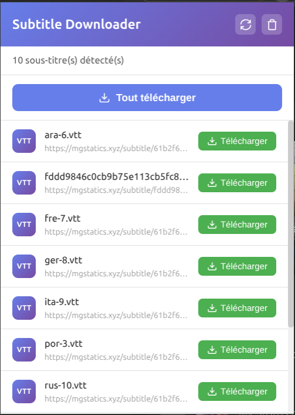
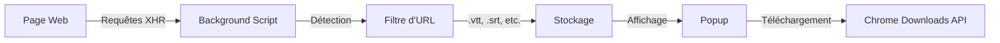

# 📥 Subtitle Downloader

<div align="center">



Une extension Chrome simple et puissante pour détecter et télécharger automatiquement les sous-titres depuis n'importe quel site web.

[Installation](#-installation) •
[Fonctionnalités](#-fonctionnalités) •
[Utilisation](#-utilisation) •
[Développement](#-développement)

</div>

---

## ✨ Fonctionnalités

- 🔍 **Détection automatique** des sous-titres chargés sur les pages web
- 📦 **Support multi-formats** : VTT, SRT, ASS, SSA, SUB, SBV, TXT
- 🎨 **Interface moderne** et intuitive avec design épuré
- ⬇️ **Téléchargement flexible** : individuel ou en masse
- 📋 **Affichage détaillé** du nom et de l'URL de chaque sous-titre
- 🔄 **Actualisation** et nettoyage de la liste en un clic

## 🚀 Installation

### Installation rapide

1. **Clonez ce dépôt**
   ```bash
   git clone https://github.com/votre-username/subtitle-downloader.git
   cd subtitle-downloader
   ```

2. **Générez les icônes** (optionnel)
   ```bash
   python3 generate_icons.py
   ```

3. **Chargez l'extension dans Chrome**
   - Ouvrez Chrome et naviguez vers `chrome://extensions/`
   - Activez le **Mode développeur** (coin supérieur droit)
   - Cliquez sur **Charger l'extension non empaquetée**
   - Sélectionnez le dossier du projet

4. **Épinglez l'extension** 📌
   - Cliquez sur l'icône puzzle dans la barre d'outils
   - Trouvez "Subtitle Downloader" et épinglez-la

## 📖 Utilisation

1. 🌐 **Naviguez** sur un site web qui charge des sous-titres
2. 🔽 **Cliquez** sur l'icône de l'extension dans la barre d'outils
3. ✅ **Les sous-titres détectés** apparaissent automatiquement
4. 📥 **Téléchargez** :
   - Bouton vert "Télécharger" → sous-titre individuel
   - Bouton bleu "Tout télécharger" → tous les sous-titres
5. 🛠️ **Gérez** la liste avec les boutons en haut à droite :
   - 🔄 Actualiser la détection
   - 🗑️ Effacer la liste

## 📂 Structure du projet

```
subtitle-downloader/
├── 📄 manifest.json        # Configuration de l'extension
├── ⚙️ background.js         # Service worker (intercepte les requêtes)
├── 🎨 popup.html            # Interface utilisateur
├── 💅 popup.css             # Styles de l'interface
├── 🧩 popup.js              # Logique de l'interface
├── 📜 content.js            # Script injecté dans les pages
├── 🖼️ icon16.png            # Icône 16x16
├── 🖼️ icon48.png            # Icône 48x48
├── 🖼️ icon128.png           # Icône 128x128
├── 🐍 generate_icons.py     # Générateur d'icônes
└── 📖 README.md             # Documentation
```

## ⚙️ Comment ça fonctionne



1. 🔍 **Interception** : Le service worker utilise `chrome.webRequest` pour capturer les requêtes
2. 🎯 **Détection** : Analyse des URLs pour identifier les fichiers de sous-titres
3. 💾 **Stockage** : Conservation en mémoire, organisée par onglet
4. 📺 **Affichage** : Liste interactive dans le popup
5. ⬇️ **Téléchargement** : Utilisation de l'API `chrome.downloads`

## 📝 Formats supportés

| Format | Extension | Description |
|--------|-----------|-------------|
| WebVTT | `.vtt` | Format standard du web |
| SubRip | `.srt` | Format universel |
| SubStation Alpha | `.ass`, `.ssa` | Sous-titres avancés |
| MicroDVD | `.sub` | Format classique |
| YouTube | `.sbv` | Format YouTube |
| Texte | `.txt` | Format simple |

## 🔧 Dépannage

<details>
<summary><b>❌ L'extension ne détecte pas les sous-titres</b></summary>

- ✅ Vérifiez que le site charge réellement des fichiers de sous-titres
- 🔄 Actualisez la page et l'extension
- 🔐 Vérifiez les permissions de l'extension
- 🐛 Ouvrez la console (F12) pour voir les logs
</details>

<details>
<summary><b>⬇️ Les téléchargements ne fonctionnent pas</b></summary>

- ⚙️ Vérifiez les paramètres de téléchargement de Chrome
- 🔓 Assurez-vous que l'extension a la permission "downloads"
- 🚫 Certains sites peuvent bloquer les téléchargements (CORS)
</details>

<details>
<summary><b>👻 L'extension ne s'affiche pas</b></summary>

- 🔧 Vérifiez que le mode développeur est activé
- 🔄 Rechargez l'extension depuis `chrome://extensions/`
- 📋 Consultez les erreurs dans la console
</details>

## 🛠️ Développement

### Modifier l'extension

1. ✏️ Modifiez les fichiers source
2. 🔄 Allez sur `chrome://extensions/`
3. 🔃 Cliquez sur "Actualiser" sur la carte de l'extension
4. 🧪 Testez vos modifications

### Permissions requises

| Permission | Usage |
|------------|-------|
| `activeTab` | Accès à l'onglet actif |
| `webRequest` | Interception des requêtes réseau |
| `downloads` | Téléchargement de fichiers |
| `storage` | Stockage de données |
| `<all_urls>` | Accès à tous les sites |

## ⚠️ Limitations

- 🚫 Ne détecte pas les sous-titres intégrés dans les flux vidéo (HLS, DASH)
- 🔒 Certains sites peuvent chiffrer ou protéger leurs sous-titres
- ⏱️ Les sous-titres en streaming temps réel peuvent ne pas être détectés

## 🚀 Roadmap

- [ ] Filtrage par type de sous-titre
- [ ] Recherche dans la liste
- [ ] Conversion entre formats (SRT ↔ VTT)
- [ ] Export de la liste
- [ ] Support des sous-titres HLS/DASH
- [ ] Historique des téléchargements
- [ ] Options de personnalisation
- [ ] Support Firefox

## 📄 Licence

MIT License - Libre d'utilisation et de modification.

## 🤝 Contribution

Les contributions sont les bienvenues ! N'hésitez pas à :
- 🐛 Signaler des bugs
- 💡 Proposer des fonctionnalités
- 🔧 Soumettre des pull requests

## 📚 Ressources

- [Documentation Chrome Extensions](https://developer.chrome.com/docs/extensions/)
- [WebRequest API](https://developer.chrome.com/docs/extensions/reference/webRequest/)
- [Downloads API](https://developer.chrome.com/docs/extensions/reference/downloads/)

---

<div align="center">


⭐ N'oubliez pas de star le projet si vous le trouvez utile !

</div>
